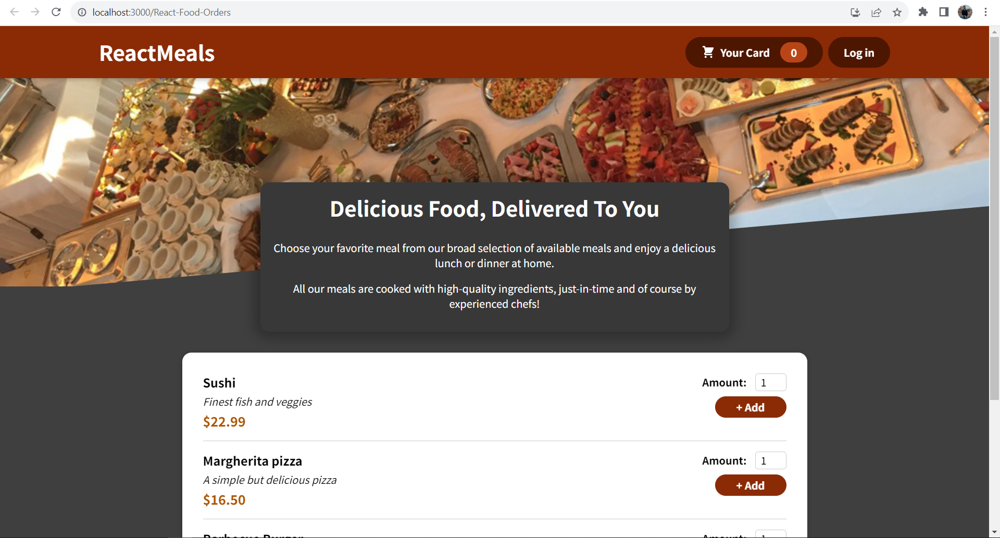

# Food Orders App Using React

### Screenshot

### Links

- Live Site URL: https://mohammad-shaar.github.io/React-Food-Orders/

## My process

### Built with

- Semantic HTML5 markup
- CSS Module
- React.js

### What I learned

This project was a culmination of my React journey, where I applied all the skills and concepts I had learned along the way.

- I used functional components to create reusable and modular UI elements, and passed props to customize their behavior and appearance.
- I also learned how to render different components based on certain conditions, and how to manage the state of my application using hooks.
- Hooks also allowed me to create my own custom hook, which was a fun and challenging experience.
- I used the context API to share data across different components without prop drilling.
- I learned how to fetch data from a server using GET and POST requests, I used Firebase as my backend service, which was easy to set up and use.
- Finally, I built a professional-looking form with basic validation.
